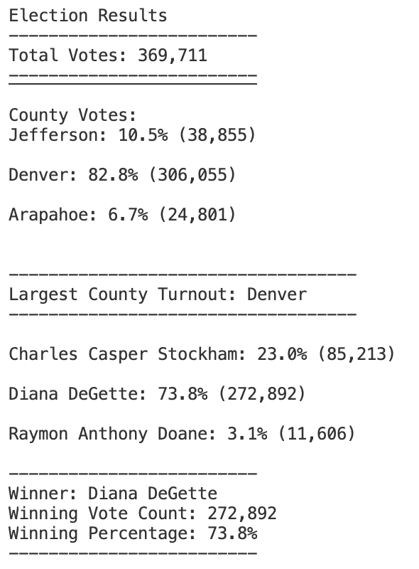
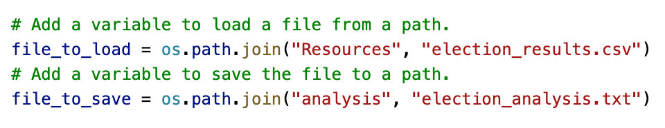

# Election_Analysis

## Project Overview
A Colorado Board of Elections employee needs to complete the elections audit of a recent local election.

Data needed:
1. Total number of votes cast
2. A complete list of candidates who received votes
3. Total number of votes each candidate received
4. Percentage of votes each candidate won
5. The winner of the election based on popular vote

## Resources
- Data Source: election_results.csv (provided by CBOE employee)
- Software: Python 3.7.6, Visual Studio Code 1.63.2
## Summary
The analysis of the election shows:
- The total votes cast in the election
- The candidates:
    - Candidate 1
    - Candidate 2
    - Candidate 3
- The candidate results
    - Candidate 1 received "x.x%" of the vote and "y" number of votes
    - Candidate 2 received "x.x%" of the vote and "y" number of votes
    - Candidate 3 received "x.x%" of the vote and "y" number of votes
- The winner of the election was:
    - Candidate 1, 2 or 3, who received "x.x%" of the vote and "y" number of votes.
    
## Challenge Overview
The election commission requested additional data to complete the audit of a recent local election.

The additional data needed:
1. The voter turnout for each county
2. The percentage of votes from each county out of the total count
3. The county with the highest turnout

## Challenge Summary
The further analysis of the election data shows:
- The county results
    - The turnout for County 1 in percentages (x.x%) and "y" number of votes  
    - The turnout for County 2 in percentages (x.x%) and "y" number of votes  
    - The turnout for County 3 in percentages (x.x%) and "y" number of votes  
- The county with the largest voter turnout

## Overview of Election Audit:
The purpose of this election audit analysis was to easily analyze the election data provided in the csv format and easily determine the results of the election through coding a script through Python. 

## Election-Audit Results: 
The election outcomes were as follows:
- How many votes were cast in this congressional election? 
    - The total votes cast in this congressional election was 369,711.
- Provide a breakdown of the number of votes and the percentage of total votes for each county in the precinct. For the counties in the precinct. 
    - Denver county had 82.8% percent of the total votes, which comes to 306,055 votes. Jefferson county had 10.5% percent of the total votes, which comes to 38,855 votes. Arapahoe county had 6.7% percent of the total votes, which comes to 24,801 votes.
- Which county had the largest number of votes?
    - The county with the largest number of votes, also known as largest turnout, was Denver.
- Provide a breakdown of the number of votes and the percentage of the total votes each candidate received. 
    - There were three candidates in the election. Diana DeGette received 73.8% percent of the total votes, which comes to 272,892 votes. Charles Casper Stockham received 23.0% percent of the total votes, which comes to 85,213 votes. Raymon Anthony Doane received 3.1% percent of the total votes, which comes to 11,606 votes.
- Which candidate won the election, what was their vote count, and what was their percentage of the total votes? 
    - Dianna DeGette won the election, receiving 73.8% percent of the total votes and 272,892 votes.

These results are supported by the terminal output from Visual Studio Code and the text file output from the analysis. [Click here to see the text file output.](Analysis/election_analysis.txt) The terminal output is as follows:  

## Election-Audit Summary: In a summary statement, provide a business proposal to the election commission on how this script can be used—with some modifications—for any election. Give at least two examples of how this script can be modified to be used for other elections.
The script that was created is able to give you data on votes, candidates and counties. With some modifications the script can be used for any election, whether the election is local, municipal or federal. To use this script for a different election, the first most modification will come from the path to the data. Replace the existing path to the correct data file. 
If the script is being used in another local election with the same data, it will work and provide the same data as seen in the election audit results section of this report. If there is more data in an election, for example, the data also tracks the political party affiliation of each voter, another repetition statement and conditional statement with logical operators will need to be added to the script to extract the political party affiliation data. In conclusion, the created script can be reused and modified for various elections and the data provided from those election. As always, the end results of the election audit are based on the data collected and provided so it is imperative that the data provided has no errors.
